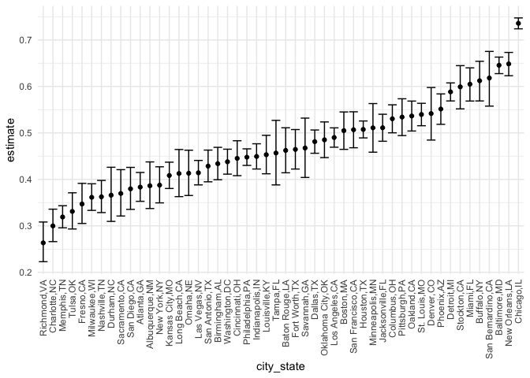
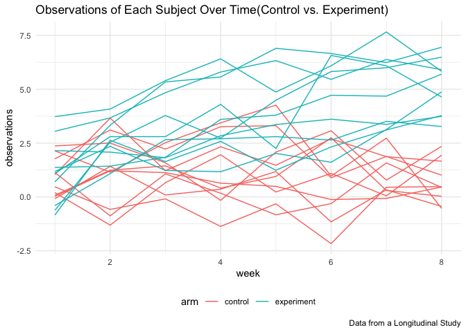

p8105\_hw5\_ry2417
================
Ruiqi Yan
11/17/2021

## Problem 1

``` r
homicide_df_raw <- 
  read_csv("data/homicide-data.csv", na = c("", "Unknown"))
```

There are 52179 cases of homicide with 12 variables in this data. The
variables are uid, reported\_date, victim\_last, victim\_first,
victim\_race, victim\_age, victim\_sex, city, state, lat, lon,
disposition. There are 28 states and 50 cities.

``` r
homicide_df <- 
  homicide_df_raw %>% 
  mutate(
    city_state = str_c(city, str_to_upper(state),sep = ","),
    resolution = case_when(
      disposition == "Closed without arrest" ~ "unsolved",
      disposition == "Open/No arrest" ~ "unsolved",
      disposition == "Closed by arrest" ~ "solved"
    )
  ) %>% 
  relocate(city_state) %>% 
  filter(city_state != "Tulsa,AL") 
```

``` r
baltimore_df <-
  homicide_df %>% 
  filter(city_state == "Baltimore,MD")

baltimore_summary <-
  baltimore_df %>% 
  summarize(
    unsolved = sum(resolution == "unsolved"),
    n = n()
  )
baltimore_test <-
  prop.test(
  x = baltimore_summary %>% pull(unsolved),
  n = baltimore_summary %>% pull(n)
)

baltimore_test %>% 
  broom::tidy()
```

    ## # A tibble: 1 × 8
    ##   estimate statistic  p.value parameter conf.low conf.high method    alternative
    ##      <dbl>     <dbl>    <dbl>     <int>    <dbl>     <dbl> <chr>     <chr>      
    ## 1    0.646      239. 6.46e-54         1    0.628     0.663 1-sample… two.sided

Let’s try to iterate across cities

First of all, write a function.

``` r
prop_test_function = function(city_df){
  city_summary <- 
    city_df %>% 
    summarize(
      unsolved = sum(resolution == "unsolved"),
      n = n()
    )
  city_test <- 
    prop.test(
      x = city_summary %>% pull(unsolved),
      n = city_summary %>% pull(n)
    )
  return(city_test)
}

homicide_df %>% 
  filter(city_state == "Albuquerque,NM") %>% 
  prop_test_function()
```

    ## 
    ##  1-sample proportions test with continuity correction
    ## 
    ## data:  city_summary %>% pull(unsolved) out of city_summary %>% pull(n), null probability 0.5
    ## X-squared = 19.114, df = 1, p-value = 1.232e-05
    ## alternative hypothesis: true p is not equal to 0.5
    ## 95 percent confidence interval:
    ##  0.3372604 0.4375766
    ## sample estimates:
    ##         p 
    ## 0.3862434

Now, let’s iterate across all cities.

``` r
results_df <-
  homicide_df %>% 
  nest(data = uid:resolution) %>% 
  mutate(
    test_results = map(data, prop_test_function),
    tidy_results = map(test_results, broom::tidy)
  ) %>% 
  select(city_state, tidy_results) %>% 
  unnest(tidy_results) %>% 
  select(city_state, estimate, starts_with("conf"))
```

Try to make a plot showing estimates and confidence intervals.

``` r
results_df %>% 
  mutate(city_state = fct_reorder(city_state, estimate)) %>% 
  ggplot(aes(x = city_state, y = estimate)) +
  geom_point() +
  geom_errorbar(aes(ymin = conf.low, ymax = conf.high)) +
  theme(axis.text.x = element_text(angle = 90, vjust = 0.5, hjust = 1))
```

<!-- -->

summarizes within cities to obtain the total number of homicides and the
number of unsolved homicides (those for which the disposition is “Closed
without arrest” or “Open/No arrest”)

``` r
results_df_2 <- 
  homicide_df %>% 
  group_by(city_state) %>% 
  summarize(
    num_homicide = n(),
    num_unsolved = sum(resolution == "unsolved")
  ) %>% 
  mutate(
    test_results = map2(num_unsolved, num_homicide, prop.test),
    tidy_results = map(test_results, broom::tidy)
  ) %>% 
  select(city_state, tidy_results) %>% 
  unnest(tidy_results) %>% 
  select(city_state, estimate, starts_with("conf"))

results_df_2 %>% 
  mutate(city_state = fct_reorder(city_state, estimate)) %>% 
  ggplot(aes(x = city_state, y = estimate)) +
  geom_point() +
  geom_errorbar(aes(ymin = conf.low, ymax = conf.high)) +
  theme(axis.text.x = element_text(angle = 90, vjust = 0.5, hjust = 1))
```

<!-- -->

## Problem 2

``` r
list_file_names <- list.files("data/data", full.names = TRUE)

study_df <- 
  tibble(
    file_names = list_file_names
  ) %>% 
  mutate(
    observation_data = map(file_names, read_csv),
    id = str_extract(file_names, pattern = "[[:digit:]]+"),
    arm = str_sub(file_names, start = 11, end = 13)
  ) %>% 
  relocate(arm, id) %>% 
  unnest(observation_data) %>% 
  select(-file_names)
```

Some examples of the resulted data frame shown as

| arm | id  | week\_1 | week\_2 | week\_3 | week\_4 | week\_5 | week\_6 | week\_7 | week\_8 |
|:----|:----|--------:|--------:|--------:|--------:|--------:|--------:|--------:|--------:|
| con | 01  |    0.20 |   -1.31 |    0.66 |    1.96 |    0.23 |    1.09 |    0.05 |    1.94 |
| con | 02  |    1.13 |   -0.88 |    1.07 |    0.17 |   -0.83 |   -0.31 |    1.58 |    0.44 |
| con | 03  |    1.77 |    3.11 |    2.22 |    3.26 |    3.31 |    0.89 |    1.88 |    1.01 |
| con | 04  |    1.04 |    3.66 |    1.22 |    2.33 |    1.47 |    2.70 |    1.87 |    1.66 |
| con | 05  |    0.47 |   -0.58 |   -0.09 |   -1.37 |   -0.32 |   -2.17 |    0.45 |    0.48 |
| con | 06  |    2.37 |    2.50 |    1.59 |   -0.16 |    2.08 |    3.07 |    0.78 |    2.35 |
| con | 07  |    0.03 |    1.21 |    1.13 |    0.64 |    0.49 |   -0.12 |   -0.07 |    0.46 |
| con | 08  |   -0.08 |    1.42 |    0.09 |    0.36 |    1.18 |   -1.16 |    0.33 |   -0.44 |
| con | 09  |    0.08 |    1.24 |    1.44 |    0.41 |    0.95 |    2.75 |    0.30 |    0.03 |
| con | 10  |    2.14 |    1.15 |    2.52 |    3.44 |    4.26 |    0.97 |    2.73 |   -0.53 |

A spaghetti plot showing observations on each subject over time

``` r
study_df %>% 
  pivot_longer(cols = starts_with("week_"),
               names_to = "week",
               names_prefix = "week_",
               values_to = "observations") %>% 
  mutate(arm_id = str_c(arm, id, sep = "_"),
         week = as.numeric(week)) %>% 
  ggplot(aes(x = week, y = observations, group = arm_id, color = arm, label = arm_id)) +
  geom_line() +
  labs(
    title = "Observations of Each Subject Over Time(Control vs. Experiment)",
    caption = "Data from a Longitudinal Study"
  ) +
  scale_color_discrete(labels = c("control", "experiment"))
```

<!-- -->

The observations of experimental arm is increasingly higher than the
observations of control arm over time. The difference of observations
between control arm and experimental arm increases over time.  

## Problem 3

``` r
set.seed(10)

iris_with_missing <- iris %>% 
  map_df(~replace(.x, sample(1:150, 20), NA)) %>%
  mutate(Species = as.character(Species))
```

``` r
fill_in_missing <- function(input_vector) {
  if (is.numeric(input_vector)) {
    output_vector <- ifelse(is.na(input_vector), 
                          mean(input_vector, na.rm = TRUE),
                          input_vector)
  } 
  if (is.character(input_vector)) {
    output_vector <- ifelse(is.na(input_vector), 
                          "virginica",
                          input_vector)
  }
  
  return(output_vector)
}

iris_no_missing <-
  iris_with_missing %>% 
  map_df(fill_in_missing)

iris_no_missing %>% 
  head(10) %>% 
  knitr::kable()
```

| Sepal.Length | Sepal.Width | Petal.Length | Petal.Width | Species |
|-------------:|------------:|-------------:|------------:|:--------|
|     5.100000 |         3.5 |     1.400000 |    0.200000 | setosa  |
|     4.900000 |         3.0 |     1.400000 |    0.200000 | setosa  |
|     4.700000 |         3.2 |     1.300000 |    0.200000 | setosa  |
|     4.600000 |         3.1 |     1.500000 |    1.192308 | setosa  |
|     5.000000 |         3.6 |     1.400000 |    0.200000 | setosa  |
|     5.400000 |         3.9 |     1.700000 |    0.400000 | setosa  |
|     5.819231 |         3.4 |     1.400000 |    0.300000 | setosa  |
|     5.000000 |         3.4 |     1.500000 |    0.200000 | setosa  |
|     4.400000 |         2.9 |     1.400000 |    0.200000 | setosa  |
|     4.900000 |         3.1 |     3.765385 |    0.100000 | setosa  |
