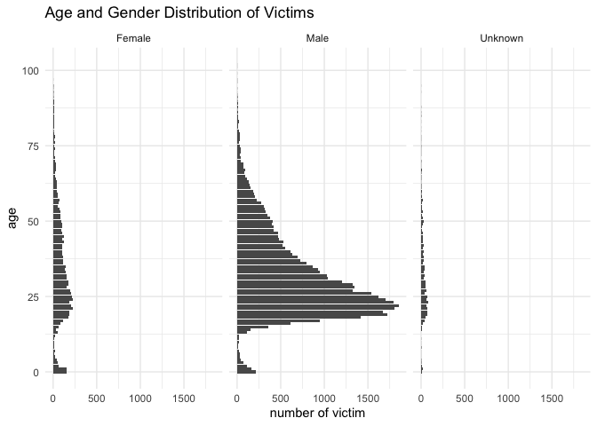

p8105\_hw5\_ry2417
================
Ruiqi Yan
11/11/2021

## Problem 1

There are 52179 cases of homicide with 12 variables in this data. The
variables are uid, reported\_date, victim\_last, victim\_first,
victim\_race, victim\_age, victim\_sex, city, state, lat, lon,
disposition. There are 28 states and 50 cities. The distribution of age
and gender of victim shown here:

<!-- -->
