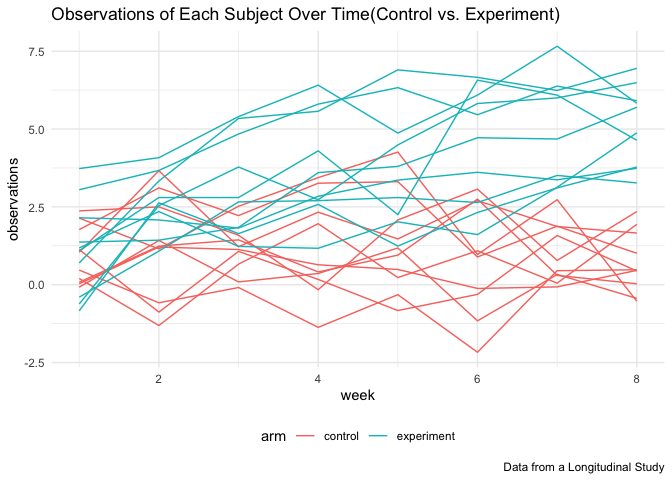

p8105\_hw5\_ry2417
================
Ruiqi Yan
11/12/2021

## Problem 1

There are 52179 cases of homicide with 12 variables in this data. The
variables are uid, reported\_date, victim\_last, victim\_first,
victim\_race, victim\_age, victim\_sex, city, state, lat, lon,
disposition. There are 28 states and 50 cities. The distribution of age
and gender of victim shown here:

<!-- -->

summarizes within cities to obtain the total number of homicides and the
number of unsolved homicides (those for which the disposition is “Closed
without arrest” or “Open/No arrest”)

| city\_state        | num\_homicide | num\_unsolved |
|:-------------------|--------------:|--------------:|
| Albuquerque, NM    |           378 |           146 |
| Atlanta, GA        |           973 |           373 |
| Baltimore, MD      |          2827 |          1825 |
| Baton Rouge, LA    |           424 |           196 |
| Birmingham, AL     |           800 |           347 |
| Boston, MA         |           614 |           310 |
| Buffalo, NY        |           521 |           319 |
| Charlotte, NC      |           687 |           206 |
| Chicago, IL        |          5535 |          4073 |
| Cincinnati, OH     |           694 |           309 |
| Columbus, OH       |          1084 |           575 |
| Dallas, TX         |          1567 |           754 |
| Denver, CO         |           312 |           169 |
| Detroit, MI        |          2519 |          1482 |
| Durham, NC         |           276 |           101 |
| Fort Worth, TX     |           549 |           255 |
| Fresno, CA         |           487 |           169 |
| Houston, TX        |          2942 |          1493 |
| Indianapolis, IN   |          1322 |           594 |
| Jacksonville, FL   |          1168 |           597 |
| Kansas City, MO    |          1190 |           486 |
| Las Vegas, NV      |          1381 |           572 |
| Long Beach, CA     |           378 |           156 |
| Los Angeles, CA    |          2257 |          1106 |
| Louisville, KY     |           576 |           261 |
| Memphis, TN        |          1514 |           483 |
| Miami, FL          |           744 |           450 |
| Milwaukee, WI      |          1115 |           403 |
| Minneapolis, MN    |           366 |           187 |
| Nashville, TN      |           767 |           278 |
| New Orleans, LA    |          1434 |           930 |
| New York, NY       |           627 |           243 |
| Oakland, CA        |           947 |           508 |
| Oklahoma City, OK  |           672 |           326 |
| Omaha, NE          |           409 |           169 |
| Philadelphia, PA   |          3037 |          1360 |
| Phoenix, AZ        |           914 |           504 |
| Pittsburgh, PA     |           631 |           337 |
| Richmond, VA       |           429 |           113 |
| Sacramento, CA     |           376 |           139 |
| San Antonio, TX    |           833 |           357 |
| San Bernardino, CA |           275 |           170 |
| San Diego, CA      |           461 |           175 |
| San Francisco, CA  |           663 |           336 |
| Savannah, GA       |           246 |           115 |
| St. Louis, MO      |          1677 |           905 |
| Stockton, CA       |           444 |           266 |
| Tampa, FL          |           208 |            95 |
| Tulsa, AL          |             1 |             0 |
| Tulsa, OK          |           583 |           193 |
| Washington, DC     |          1345 |           589 |

## Problem 2

Some examples of the resulted data frame shown as

| arm | id  | week | observations |
|:----|:----|:-----|-------------:|
| con | 01  | 1    |         0.20 |
| con | 01  | 2    |        -1.31 |
| con | 01  | 3    |         0.66 |
| con | 01  | 4    |         1.96 |
| con | 01  | 5    |         0.23 |
| con | 01  | 6    |         1.09 |
| con | 01  | 7    |         0.05 |
| con | 01  | 8    |         1.94 |
| con | 02  | 1    |         1.13 |
| con | 02  | 2    |        -0.88 |

A spaghetti plot showing observations on each subject over time

<!-- -->

The observations of experimental arm is increasingly higher than the
observations of control arm over time. The difference of observations
between control arm and experimental arm increases over time.  

## 
